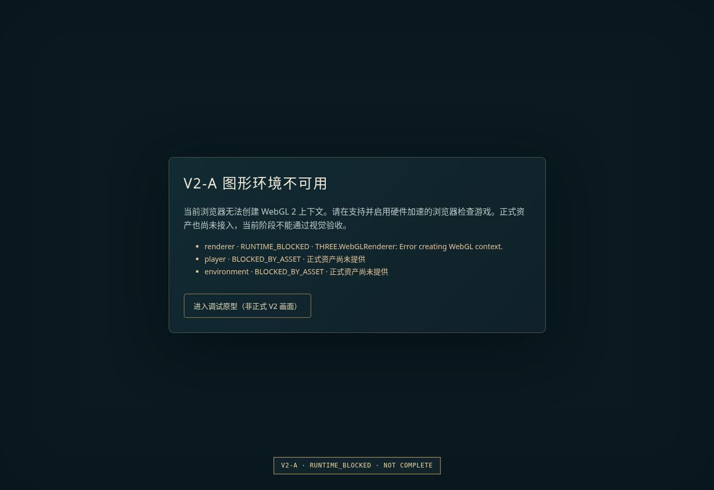

> HISTORICAL REPORT: old blocking gates below are superseded by [V2_GATES.md](V2_GATES.md). Disabled cloud GL is an environment limitation, not Renderer QA Failure.

# V2-A Visual Foundation — NOT COMPLETE

基线：`f1865d6`（包含用户加入的 GitHub Pages 部署工作流）。
范围：只实施新需求第 66 节的 V2-A。新 MD 为 `V2_REQUIREMENTS.md`。本分支不是 V2 Vertical Slice Complete，不能合并为已验收成品；V2-B 至 V2-H 未开始。

## 本次实现及运行接入

| 文件 | 作用 |
|---|---|
| `src/render/RendererPipeline.js` | 主入口使用的统一 Renderer、Scene、Camera、后处理、质量、resize 和销毁管理 |
| `src/render/LightingRig.js` | 暖太阳、冷补光、天空光、轮廓光、局部光接口、方向阴影跟随 |
| `src/render/AnimeMaterial.js` | 接入调试角色和正式 GLTF 实例：三阶柔边明暗、冷影暖光、受光方向约束的 Rim、七种材质参数 |
| `src/render/EnvironmentMaterial.js` | 调试环境及正式环境加载使用的 PBR 材质接口，Base/Normal/Roughness/AO/Emissive、Detail Normal 和 Macro Variation |
| `src/render/PostProcessing.js` | RenderPass、显式选择的 Bloom、颜色分级、暗角、OutputPass、FXAA；非选中物体保留遮挡；异常后恢复材质 |
| `src/render/QualityManager.js` | 两次低于 45 FPS 的采样后逐步降低视觉开销，稳定恢复带迟滞；不改敌人数量与保存偏好 |
| `src/assets/AssetLoader.js` | 真实 GLTFLoader/DRACOLoader/KTX2Loader、合同校验、缓存、超时、资源释放、SkinnedMesh 克隆、AnimationMixer 与材质绑定 |
| `src/assets/manifest.js` | 正式模型、来源授权、骨骼、14 个动画、Weapon 节点、环境纹理合同；当前路径明确为空 |
| `src/world/scene.js` | 复用旧逻辑，移走渲染配置；旧场景只能显式以 debugAssets 模式构造 |
| `src/main.js` | 默认加载正式资产；资产缺失显示阻碍，调试模式才进入旧游戏；接入质量采样与清理 |
| `src/render/foundation.css` | 仅为调试标签及资产/运行状态门禁提供样式，未开始 V2-G UI 重做 |
| `tests/render-foundation.test.js` | V2-A 行为测试，包括真实内嵌 GLB 解析、骨骼实例、质量与 Bloom 资源管理 |

伤害、装备、背包、技能、存档格式、输入、EventBus、敌人/Boss AI、路线没有改动。`package.json`、锁文件、`vite.config.js`、两个现有 workflow 均保持基线内容。

## 实际测试结果

| 检查 | 结果 | 证据边界 |
|---|---|---|
| `npm test` | PASS：32/32 | 原有 18 项 + V2-A 14 项，Node/JSDOM，不能替代 GPU 检查 |
| `npm run build` | PASS | 保持原 `--base=./`，主引擎大 chunk 仍有警告 |
| Pages 子路径和解码器产物 | PASS（本地） | 入口文件相对引用存在，Three r185 自带的 Draco/Basis URL 经 Vite 打包为本地 hash 文件，无额外 CDN/重复解码器复制 |
| 受保护文件比对 | PASS | 玩法、存档、输入、依赖和 Pages workflow 与基线逐字一致 |
| 浏览器启动 | RUNTIME_BLOCKED | 页面可访问，但 WebGL 上下文创建失败；控制台 `GL_VENDOR = Disabled, GL_RENDERER = Disabled` |
| 运行截图 | 已捕获阻碍页 | 见下图；不是正式场景截图，不用于视觉 PASS |
| Shader GPU 编译、灯光、Bloom 视觉 | NOT VERIFIED | WebGL 在创建阶段失败，未执行实际绘制 |
| Draco/KTX2 真实压缩资产解码 | NOT VERIFIED | 解码器接入并打包，但没有正式压缩模型/纹理样本 |
| 手机触摸/布局、50–60 FPS、发热、GPU 内存 | NOT VERIFIED | 没有真实设备结果 |



## 可见变化

- 正常地址：有 WebGL 时显示 `BLOCKED_BY_ASSET`，因为正式角色和环境尚未提供。不会静默显示方块人或圆锥树。
- `?debugAssets=1`：有 WebGL 时才进入原型游戏，并持续标记 `ASSET FALLBACK · PROTOTYPE · V2-A NOT COMPLETE`。原型接入新的材质/灯光/后处理；视觉效果还没有 GPU 实测。
- WebGL 不可用：明确显示 `RUNTIME_BLOCKED`，不留下空白屏。
- 若未来资产满足合同，默认模式只开放已加载资产的视觉检查，不宣称角色动画或完整 V2 游戏已完成。

## 资产合同与阻碍

1. `player`：有来源授权的玩家 GLB/GLTF；骨骼 SkinnedMesh；节点 `Weapon`；动画名为 Idle、Run、Attack1–4、Skill1–4、Ultimate、Dodge、Hit、Death。
2. `environment`：有来源授权的森林遗迹资产；至少 Base Color、Normal、Roughness、AO。资产层级和美术品质仍须人工验收。
3. 资产放在 Vite 可发布目录，例如 `public/assets/...`。`manifest.js` 的 `path` 写 `assets/...`，禁止写 `/assets/...`，并填写 `license` 为可核验的来源说明。
4. GLTF 材质可用 `extras.astralType` 指定 skin/cloth/metal/leather/hair/crystal/magic；明确获准发光的材质或节点用 `extras.astralBloom = true`，不按“颜色亮”自动把整场景加入 Bloom。
5. 用于测试的程序几何体/最小 GLB 仅是测试 fixture，未作为正式模型放入发布资产。

资产检查的 READY 只表示结构合同通过，不代表视觉合格、授权核查完成或 V2-C 动画同步完成。正式敌人、正式环境制作、武器轨迹、完整动画与接触层次均仍有后续门禁。

## 阶段决策

**NOT COMPLETE。停止在 V2-A，不进入 V2-B。**

依据新 MD 第 66–69、78–82 节，需要正式资产与可运行 WebGL 的截图/视觉检查后，才能通过当前阶段。V2-A 放在独立草稿分支；没有更新 `main`、没有触发主分支 Pages 部署。后续先解除资产和 GPU 阻碍，再核验当前管线，不增加新玩法。

## 本地检查与回滚

```bash
git fetch origin
git switch v2-a-visual-foundation
npm ci
npm test
npm run build
npm run dev
```

开发服务器地址后附 `?debugAssets=1` 查看明确标注的原型；默认是正式资产门禁。要恢复基线，先保留自己的未提交修改，再切回 `main`。本分支不改变 localStorage 存档 schema，也不会自动迁移或清除旧存档。
